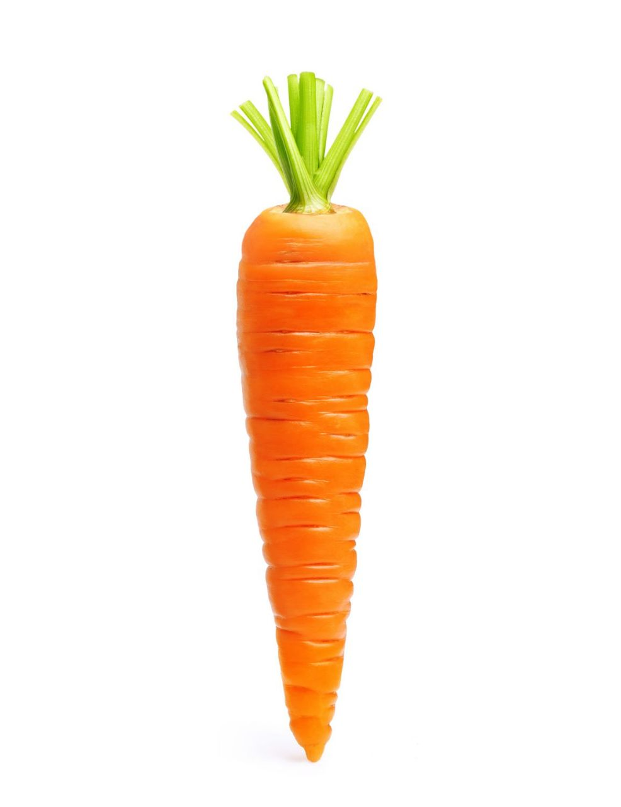
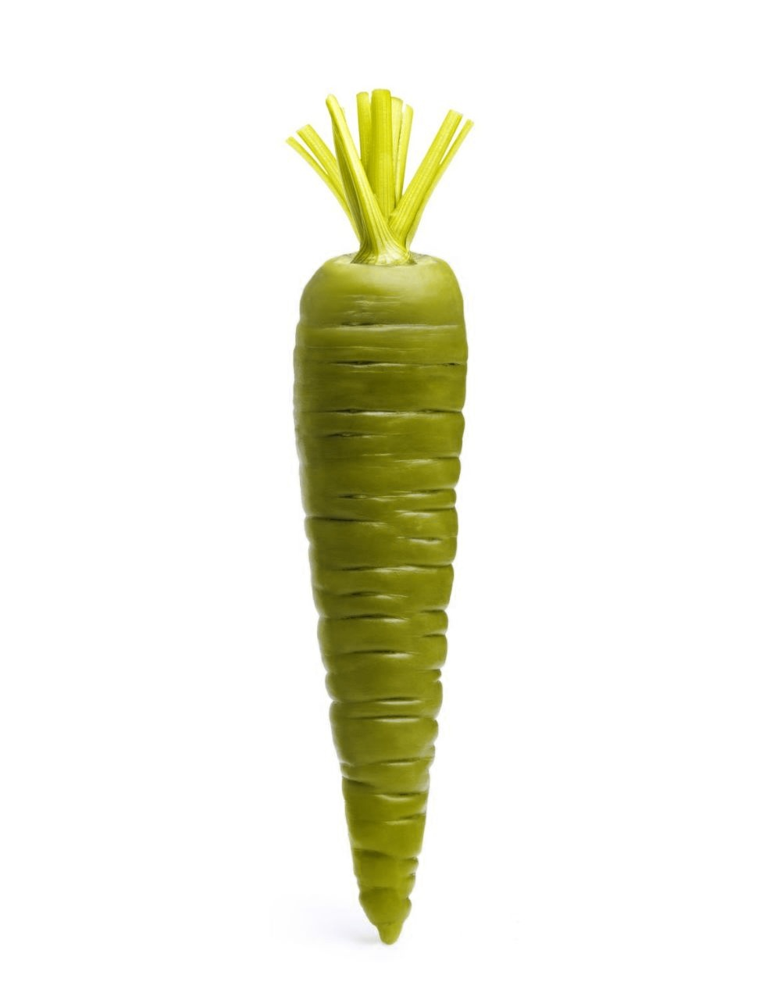
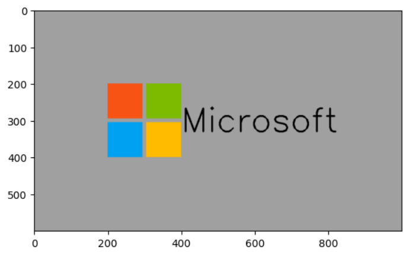
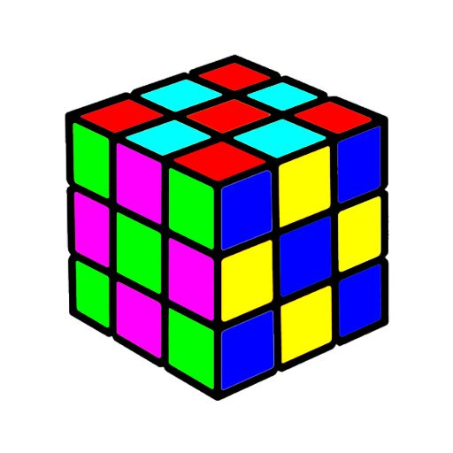
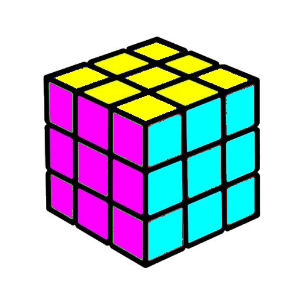
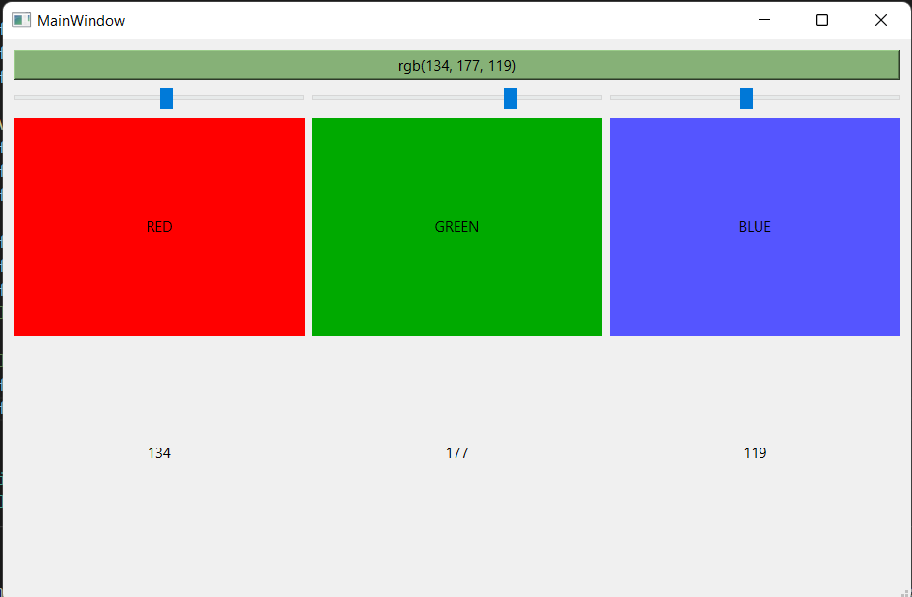

# Image_processing9

## havich.ipynb
Rendre vert la carotte sans changer la couleur des feuilles :

la sortie:

## microsoft_logo

### créer logo de Microsoft avec OpenCv, Matplotlib et Numpy...

## rubikCube

### Résoudre le cube de rubik par modifier RGB 

## colorPicker

### élaborer pipette à couleurs par OpenCv et Qt :

il nous montre la quantite de chaque couleur(RGB) qui est changeable par slidbar.
finalement vous pouvez voir le résultat et la couleur en haut de l'image.

### Detect_colors

ce programme est capable de détecter des couleurs mentionnées ci-dessous:
(blanc, noir, rouge, vert, jaune, gris, rose, bleu et turquoise)